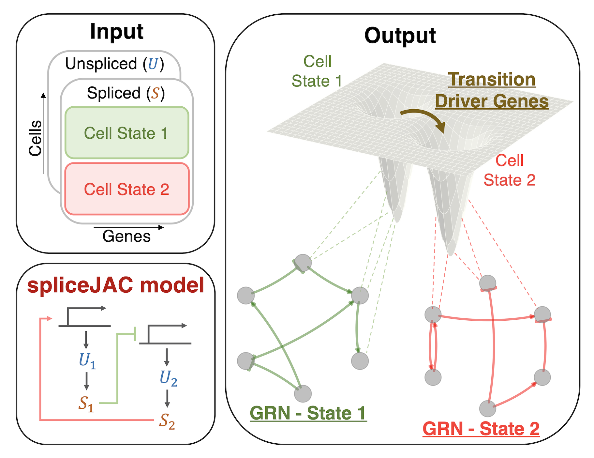

## spliceJAC: Identify transition driver genes and cell state specific regulatory interactions from single-cell transcriptome data

spliceJAC is a python-based toolkit to reconstruct cell state-specific gene regulatory networks (GRN) and predict transition driver genes leading to cell differentiation. 

### Applications

Application of spliceJAC include:

- Investigate the context-specific signaling role of genes in different cell states.

- Analyze multi-stable systems where several cell states can coexist.

- Distinguish the transition driver genes leading to distinct differentiation paths stemming from a common initial state.

### Use and installation

Details coming up shortly.

### References

Federico Bocci, Peijie Zhou, Qing Nie, spliceJAC: Identify transition driver genes and cell state specific regulatory interactions from single-cell transcriptome data, Preprint (2022).

The detailed testing and benchmarking of spliceJAC is publicly available [here](https://github.com/cliffzhou92/jacobian-inference-benchmarking).

### Further reading

Bergen et al. (2020), Generalizing RNA velocity to transient cell states through dynamical modeling, [Nature Biotechnology](https://www.nature.com/articles/s41587-020-0591-3).

Pratapa et al. (2020), Benchmarking algorithms for gene regulatory network inference from single cell transcriptomic data, [Nature Methods](https://www.nature.com/articles/s41592-019-0690-6).

Wolf et al. (2018), SCANPY: large-scale single-cell gene expression data analysis, [Genome Biology](https://genomebiology.biomedcentral.com/articles/10.1186/s13059-017-1382-0).

### Contact and support

Questions or suggestions are welcomed and highly appreciated. You can contact us by opening an issue or via email at fbocci@uci.edu.
